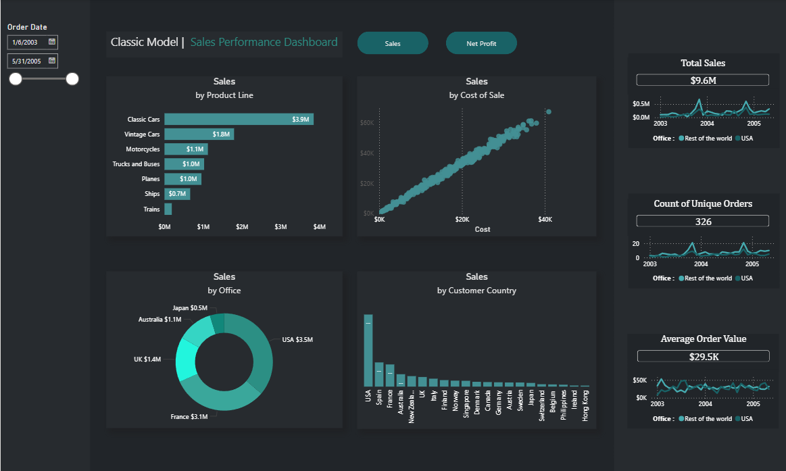

# Sales Performance Dashboard

An interactive Power BI dashboard analyzing sales performance across products, customers, countries, and offices using the Classic Models dataset.

## Overview

Built an interactive business intelligence dashboard by cleaning, modeling, and analyzing a dataset of **2,996 sales records**. The dashboard provides insights into sales performance, profitability, customer behavior, and regional trends to support data-driven business decisions.

## Tools Used

- Microsoft Power BI
- Power Query
- DAX (Data Analysis Expressions)
- Data Modeling
- Interactive Slicers & Bookmarks

## Features

- KPI cards for Total Sales, Net Profit, Unique Orders, and Average Order Value
- Sales analysis by Product Line
- Sales vs. Cost of Sales scatter plot
- Sales distribution by Office
- Customer Country sales analysis
- Interactive Order Date slicer for filterin
- Navigation buttons to switch between Sales and Net Profit reports

## Dataset

- **Dataset:** Classic Models
- **Records:** 2,996 sales transactions
- **Dimensions:** Product Line, Customer, Country, Office, Order Date
- **Measures:** Sales, Cost, Net Profit

## Files

- `classic-model-sales-dashboard.pbix` — Power BI project file
- `classic-model-dashboard.pdf` — Dashboard report export
- `screenshot.png` — Dashboard preview image

## Preview

## Key Insights

- USA generated the highest sales among all offices.
- Classic Cars was the highest-performing product line.
- Sales showed a strong positive correlation with the cost of sales.

## Skills Demonstrated

- Data Cleaning
- Power Query
- Data Modeling
- DAX Measures
- Interactive Dashboard Design
- Business Intelligence
- Data Visualization
- KPI Reporting
- Dashboard Navigation using Bookmarks
